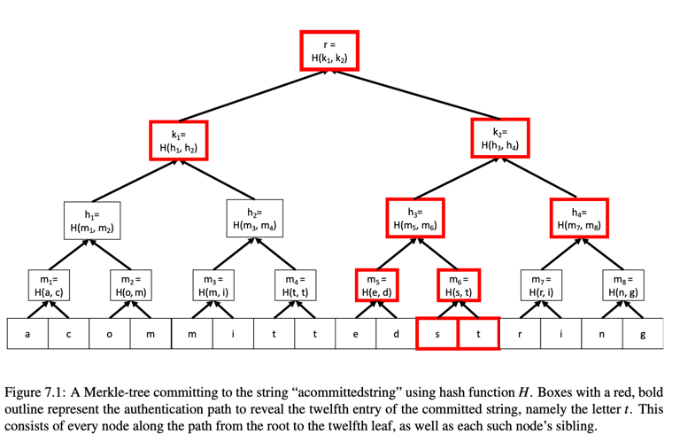

# A First Succinct Argument for Circuit Satisfiability, from Interactive Proofs

* Goal
  This transformation is only useful in the context of interactive proofs and arguments if we can design
  efficient proof systems for solving instances of circuit satisfiability.

  In this section, we will see our first example of such an argument system, by combining the GKR protocol with a cryptographic primitive called
  a polynomial commitment scheme.   

## preliminaries
### Circuit-SAT
> arithmetic circuit satisfiability problem (aka. circuit-SAT):

The circuit C takes two inputs, x and w. The first input x is public and fixed. The second input w is often called the witness,
or the non-deterministic/auxiliary input.
Given the first input x and output y, the goal is to determine whether there exists a w such that `C(x, w) = y`.

eg: In RAM case, P claims it knows some witness w(not known to the verifier) which applying C to (x, w), or running M on (x, w), yields output y.

### commitment scheme

Cryptographic Commitment Schemes. Conceptually, cryptographic commitment schemes can be described via the following metaphor. 
They allow the committer to take some object b (b could be a field element, vector, polynomial, etc.) place b in a box 
and lock it, and then send the locked box to a “verifier”. The committer holds on to the key to the lock. Later, the 
verifier can ask the committer to open the box, which the committer can do by sending the verifier the key to the lock. 

* Most commitment schemes satisfy two properties: hiding and binding. 
  In the metaphor, hiding means that the verifier can not “see inside” the locked box to learn anything about the object within it. 
  Binding means that once the box is locked and transmitted to the verifier, the committer cannot change the object within the box. 

#### Polynomial Commitment Schemes. 
A polynomial commitment scheme is simply a commitment scheme in which the object being committed to is (all evaluations of) 
a low-degree polynomial. That is, a polynomial commitment scheme allows a prover to commit to a polynomial w ̃ satisfying 
a specified degree bound, and later reveal w ̃(r) for a point r of the verifier’s choosing. 

Even though in the commitment phase the prover does not send all evaluations of w􏰌 to the verifier, the commitment still 
effectively binds the prover to a specific w􏰌. That is, at a later time, the verifier can ask the prover to reveal w ̃(r) 
for any desired r of the verifier’s choosing, and the prover is effectively forced to reveal w ̃(r) for a fixed polynomial w ̃
determined at the time of the original commitment. In particular, the prover is unable to choose the polynomial w ̃ to 
depend on the query point r, at least not without breaking the computational assumption on which security of the commitment 
scheme is based.

### Merkle tree

## Arguments of Knowledge and SNARKs
Arguments for circuit satisfiability are particularly useful when they satisfy an enhanced soundness property called 
knowledge-soundness. This means that the prover establishes not only that there `exists` a witness w such that C(x, w) = y, 
but also the prover `knows` such a w.

* Knowledge-soundness
  Knowledge-soundness can be a meaningful notion even when standard soundness is not. 
  For example, suppose the prover and verifier agree on a cryptographic hash function h and hash value y, and the prover
  claims to know a w such that h(w) = y. The prover can establish this by applying a knowledge-sound argument for 
  circuit-satisfiability to a circuit C that takes w as input and computes h(w).

* standard soundness

  An argument satisfying standard soundness, which only guarantees the `existence` of a witness w such that C(w) = y,  
  would be useless in this context. This is because cryptographic hash functions are typically
  surjective, meaning for any y there will exist many pre-images w. Accordingly, the trivial proof system
  where the verifier always accepts satisfies standard soundness in this context, but not knowledge-soundness.
  
* SNARKs
  Knowledge-sound arguments can be particularly useful when they satisfy:
  * non-interactive: meaning the proof is just a static string that is accepted or rejected by the verifier, 
  * succinct, meaning that the proofs are very short. 

Such arguments are called SNARKs.

## Polynomial Commitment Scheme
> folklore commitment scheme (it was also explicitly proposed by Yael Kalai [Kal17]).

### Merkle Trees 
Merkle tree makes use of a collision-resistant hash function h mapping inputs to {0,1}^κ.

The leaves of the tree are the symbols of a string s, and every internal node of the tree is assigned the hash of its two children.

#### string-commitment scheme
Merkle Trees be used to design a string commitment scheme, One obtains a string-commitment protocol from a Merkle tree as follows:
* In the commitment step, the sender commits to the string s by sending the root of the hash-tree.
* The Reveal step,
  If the sender is later asked to reveal the ith symbol in s, the sender sends the value of the ith leaf in the tree (i.e., si), 
  as well as the value of every node v along the root-to-leaf path for si, and the sibling of each such node v. 
  
  The receiver checks that the hash of every two siblings sent equals the claimed value of their paren

### low-degree tests
Low degree testing refers to the problem of deciding whether a given function is a polynomial of some bounded degree, 
by making only a small number of queries to the function. It's a central tool in the theory of probabilistic proofs

## Reference
[Low Degree Testing-Starkware](https://medium.com/starkware/low-degree-testing-f7614f5172db#:~:text=L%20ow%20degree%20testing%20refers%20to%20the%20problem,central%20tool%20in%20the%20theory%20of%20probabilistic%20proofs.)
